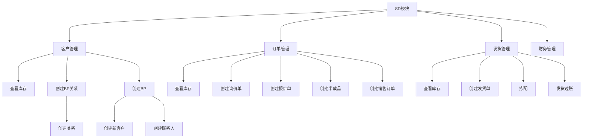

# ERP系统复现开发文档

##  分工

+ 需要有人总结所有数据对象的条目

##  角色问题

### David

+ 创建新客户
+ 创建报价单
+ 基于报价单创建销售订单

### 仓库主管

+ 启动发货

##  注意

+ 销售订单规定了发货时间
+ 创建发货单的同时会创建发货单半成品
+ 

##   U/C矩阵

|                  过程                  | Fi Customer | Customer | Contact Person | (BP)Contact realationship | 询价单 | 报价单 |  库存数据   | 销售订单 | 半成品 | 发货单        | 发票 |
| :------------------------------------: | :---------: | :------: | :------------: | :-----------------------: | ------ | ------ | :---------: | :------: | :----: | ------------- | ---- |
|        创建新客户 FI （子过程）        |      C      |          |                |                           |        |        |             |          |        |               |      |
|         创建新客户 （子过程）          |             |    C     |                |                           |        |        |             |          |        |               |      |
|             创建公司联系人             |             |          |       C        |                           |        |        |             |          |        |               |      |
|                创建关系                |             |          |                |             C             |        |        |             |          |        |               |      |
|               创建询价单               |             |          |                |                           | C      |        |             |          |        |               |      |
|               创建报价单               |             |          |                |                           |        | C      |             |          |        |               |      |
| 基于报价单创建销售订单(同时创建半成品) |             |          |                |                           |        |        |             |    C     |   C    |               |      |
|              查看库存状态              |             |          |                |                           |        |        |      U      |          |        |               |      |
|              查看销售订单              |             |          |                |                           |        |        |             |    U     |        |               |      |
|       创建发货单（仓库管理员A）        |             |          |                |                           |        |        |             |          |   U    | C             |      |
|              查看库存状态              |             |          |                |                           |        |        |      U      |          |        |               |      |
|   按照发货单进行拣配（仓库管理员A）    |             |          |                |                           |        |        | U库存减少了 |          |        | U             |      |
|         发货过账 （仓库主管）          |             |          |                |                           |        |        |             |          |        | U记录过账日期 |      |
|              查看库存状态              |             |          |                |                           |        |        |      U      |          |        |               |      |
|                创建发票                |             |          |                |                           |        |        |             |          |        |               | C    |
|        查看发票（看组里人意见）        |             |          |                |                           |        |        |             |          |        |               |      |
|              展示单据流程              |             |          |                |                           |        |        |             |          |        |               |      |

