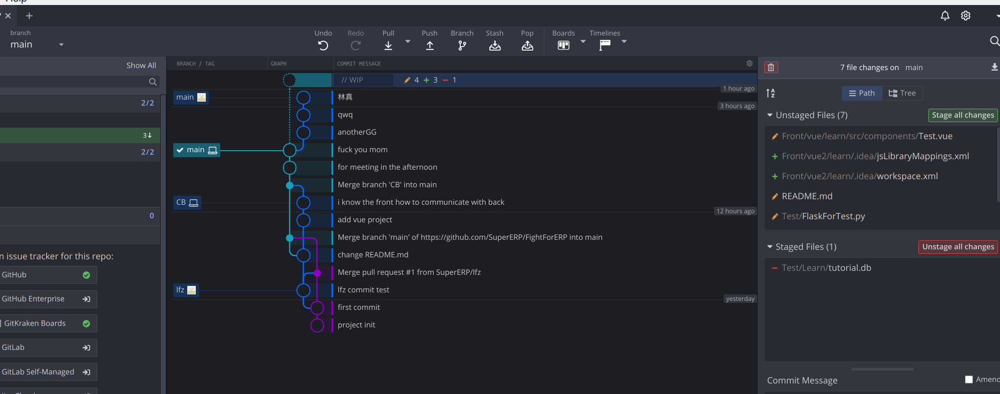
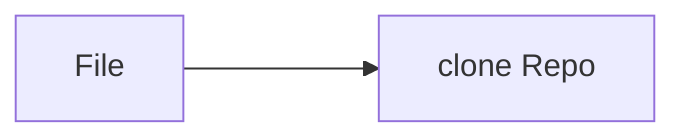
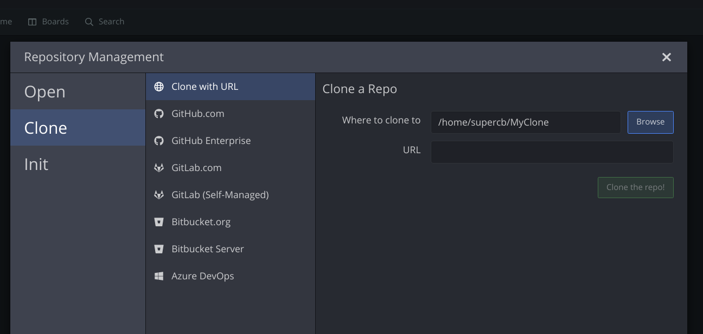
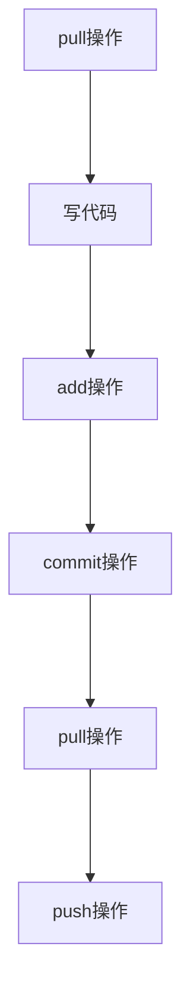
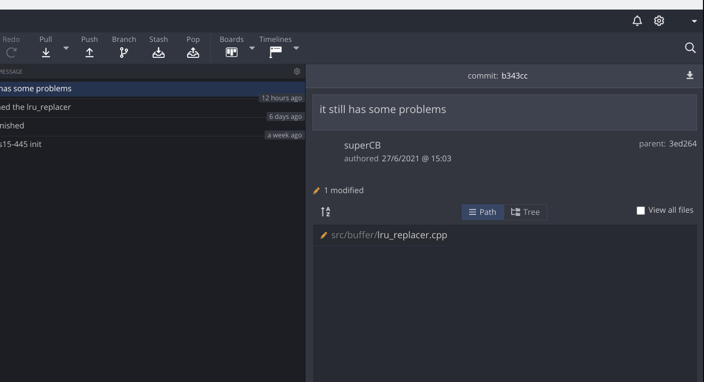
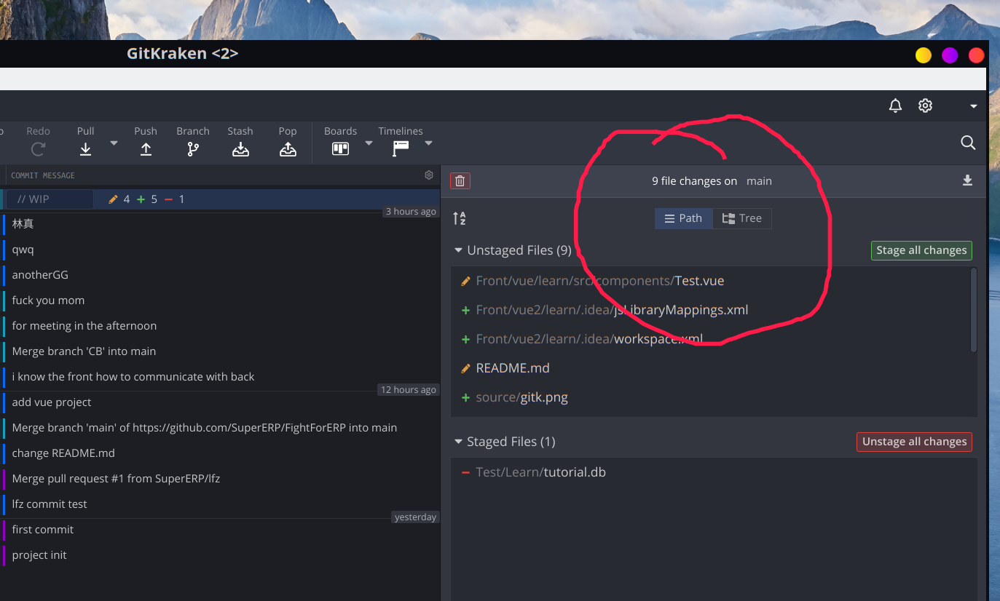
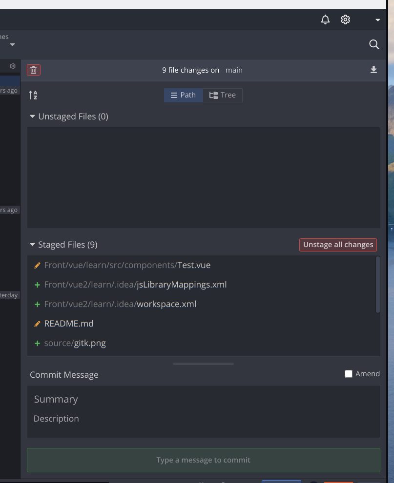
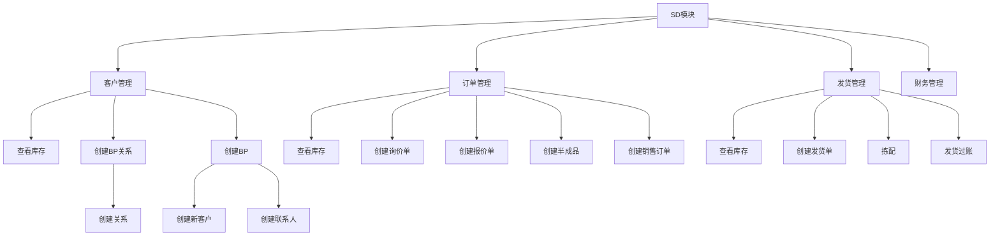

*本文档严禁外泄*

# ERP系统复现开发文档


### 项目结构

```powershell
.
├── ERP //后端代码
│   ├── __init__.py
│   ├── MasterData
│   └── ORMData
├── Front //前端代码
│   ├── babel.config.js
│   ├── node_modules
│   ├── package.json
│   ├── package-lock.json
│   ├── public
│   ├── README.md
│   └── src
├── main.py //主运行文件
├── README.md
├── source
│   ├── gitk2.png
│   ├── gitk3.png
│   ├── gitk4.png
│   └── gitk.png
└── Test //用于学习与测试
    ├── FlaskForTest.py
    └── Learn

```

## 环境搭建

### Git

+ 实现版本控制
+ [Git是干嘛的？](https://zhuanlan.zhihu.com/p/99313784)

### 如何使用Gitkraken?

[下载地址](https://www.gitkraken.com/)

#### Gitbraken的优点

+ 极其简单易学
+ 不需要记住任何命令行以及参数，只需按按钮就能够完成Git的基本操作
+ 全部流程可视化，简单直观


#### 如何使用Gitkraken完成本次项目开发?

gitkraken使用前需要与Githubz账号绑定，请注意这一点

**请使用Windows系统的同学，重新完成以下流程**

#####  clone仓库

请按照以下流程操作



然后会显示出以下页面



请将 **https://github.com/SuperERP/FightForERP.git** 填入到URL中，即可完成工作。

#####  如何使用Gitkraken？

+ 在使用之前，我们需要大致了解Git的工作原理。

.
**操作流程**

在你弄清楚Git的原理之前，请严格按照以下流程操作，否则将会出现难以解决的问题。至于为什么会按照以下流程完成工作，请研究Git的工作原理



+ 首先要完成pull操作。pull代表将远程库的代码与本地库的代码同步。**我们可以很容易的在Gitkraken的操作面板上找到pull按钮。**

+ 当你成功完成pull操作的时候，会看到以下结果

  

  

+ 当你完成代码的编写工作之后，你的**Gitkraken界面**应该是这样的。请特别注意**file changes**这一行，如果没有显示这一行的话，这说明你并没有在项目中编写代码。

  

  

  出现上面的页面之后，请点击**Stage all changes**按钮。

  你会看到以下界面，

  

  **下一步，你必须在Commit Message中加入对你这次编程工作的总结。这一步骤是必须的，请在这个步骤中写入对你编程工作的准确概括。**

  将Summary输入完毕后，下方的按钮会变亮，**点击即可**。

+ 然后再次点击**pull按钮**
+ 最后点击**push按钮**


### 如何完成前端开发？

#### 前端开发工具

[WebStorm](https://www.jetbrains.com/webstorm/download/#section=windows)

#### 学习视频

[链接](https://www.bilibili.com/video/av85793766)

只需四小时 

只需四小时 

只需四小时

#### 开发须知

+ 请注意，我们并不需要从头创建Vue项目，本项目的前端框架已经预先创建好了，我们只需要将其运行起来就可以了。

+ 请**特别注意**，请特别注意，负责前端的人**在执行push操作之前**，一定要将node_modules文件全部删除，因为这个文件的体积非常之大会影响Git的上传速度。**该文件夹会在之后的过程中重新建立**。

  ```powershell
  .
  ├── ERP 
  │   ├── __init__.py
  │   ├── MasterDatapowershell
  │   └── ORMData
  ├── Front 
  │   ├── babel.config.js
  │   ├── node_modules //请务必删除这个文件
  │   ├── package.json
  │   ├── package-lock.json
  │   ├── public
  │   ├── README.md
  │   └── src
  ├── main.py 
  ├── README.md
  ├── source
  │   ├── gitk2.png
  │   ├── gitk3.png
  │   ├── gitk4.png
  │   └── gitk.png
  └── Test 
      ├── FlaskForTest.py
      └── Learn
  
  ```

+ 后端代码从GitHub中更新完后是可以直接运行的,但是前端代码是不可以的

####   如何完成前端开发？

+ 搭建环境(本操作只做一次就可以)

  + 安装[Node.js](https://nodejs.org/zh-cn/)(请使用该下载链接),并将其安装到C盘。如果没有安装到C盘，你的调试过程会非常繁琐。

  + 打开**Windows命令行**，运行以下命令

    ```powershell
    npm install -g cnpm --registry=https://registry.npm.taobao.org
    ```

  + 输入```cnpm -v```查看是否安装完成

+ 搭建运行环境

  请在windows的命令行中执行以下操作(必须要在Front文件夹的路径下)

  ```powershell
  cnpm install
  ```

  只有在两种情况下才需要进行这个操作

  1. 你刚刚完成clone操作或者是pull操作，Front中没有node_modules文件夹
  2. 你上次push前删除了node_modules文件夹，现在你想继续完成开发

+ 运行前端项目

  (没有node_modules将无法正常运行)

  请在Font的文件夹的路径下运行以下指令

  ```powershell
  cnpm run serve
  ```

  如果顺利的话，你将看到以下输出

  

##  分工

+ 需要有人总结所有数据对象的条目


##  角色问题

### David

+ 创建新客户
+ 创建报价单
+ 基于报价单创建销售订单


### 仓库主管

+ 启动发货


##  注意

+ 销售订单规定了发货时间
+ 创建发货单的同时会创建发货单半成品
+ 

##   U/C矩阵

|                  过程                  | Fi Customer | Customer | Contact Person | (BP)Contact realationship | 询价单 | 报价单 |  库存数据   | 销售订单 | 半成品 | 发货单        | 发票 |
| :------------------------------------: | :---------: | :------: | :------------: | :-----------------------: | ------ | ------ | :---------: | :------: | :----: | ------------- | ---- |
|        创建新客户 FI （子过程）        |      C      |          |                |                           |        |        |             |          |        |               |      |
|         创建新客户 （子过程）          |             |    C     |                |                           |        |        |             |          |        |               |      |
|             创建公司联系人             |             |          |       C        |                           |        |        |             |          |        |               |      |
|                创建关系                |             |          |                |             C             |        |        |             |          |        |               |      |
|               创建询价单               |             |          |                |                           | C      |        |             |          |        |               |      |
|               创建报价单               |             |          |                |                           |        | C      |             |          |        |               |      |
| 基于报价单创建销售订单(同时创建半成品) |             |          |                |                           |        |        |             |    C     |   C    |               |      |
|              查看库存状态              |             |          |                |                           |        |        |      U      |          |        |               |      |
|              查看销售订单              |             |          |                |                           |        |        |             |    U     |        |               |      |
|       创建发货单（仓库管理员A）        |             |          |                |                           |        |        |             |          |   U    | C             |      |
|              查看库存状态              |             |          |                |                           |        |        |      U      |          |        |               |      |
|   按照发货单进行拣配（仓库管理员A）    |             |          |                |                           |        |        | U库存减少了 |          |        | U             |      |
|         发货过账 （仓库主管）          |             |          |                |                           |        |        |             |          |        | U记录过账日期 |      |
|              查看库存状态              |             |          |                |                           |        |        |      U      |          |        |               |      |
|                创建发票                |             |          |                |                           |        |        |             |          |        |               | C    |
|        查看发票（看组里人意见）        |             |          |                |                           |        |        |             |          |        |               |      |
|              展示单据流程              |             |          |                |                           |        |        |             |          |        |               |      |





